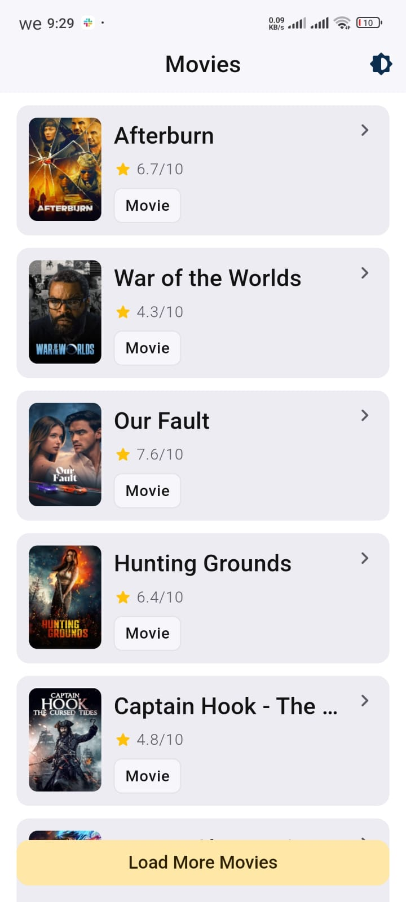
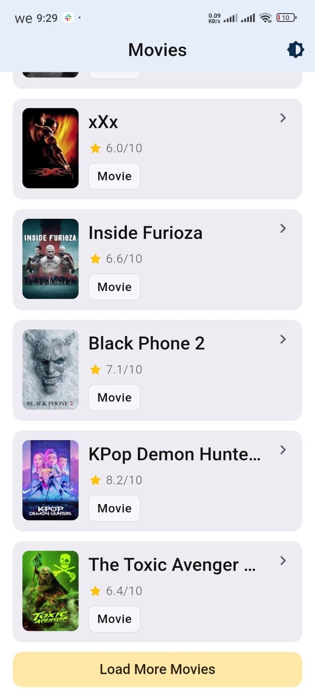
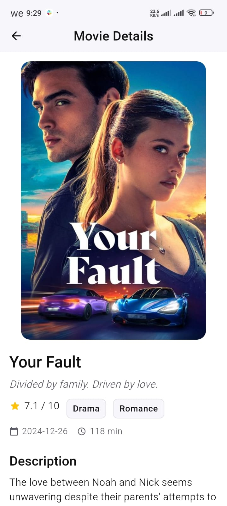
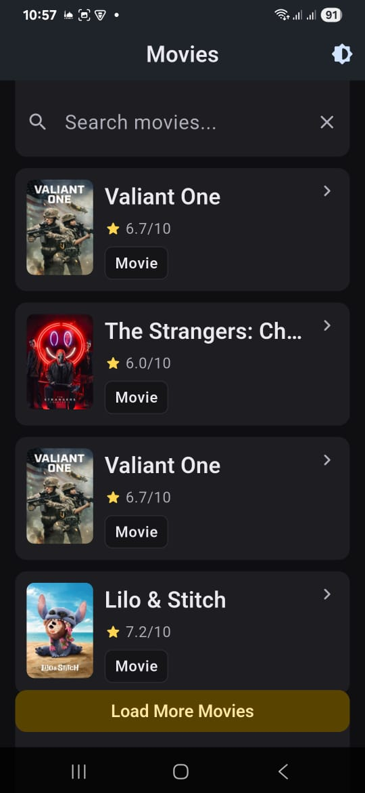
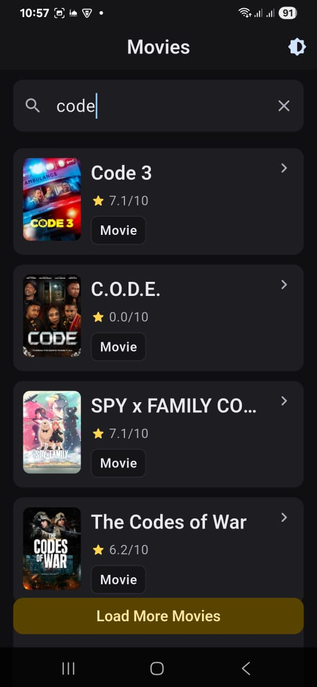
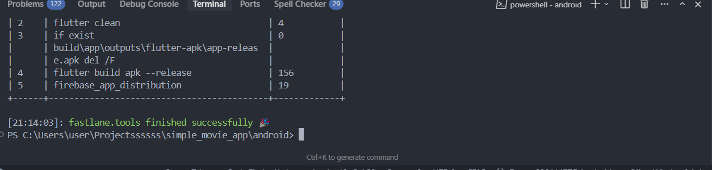
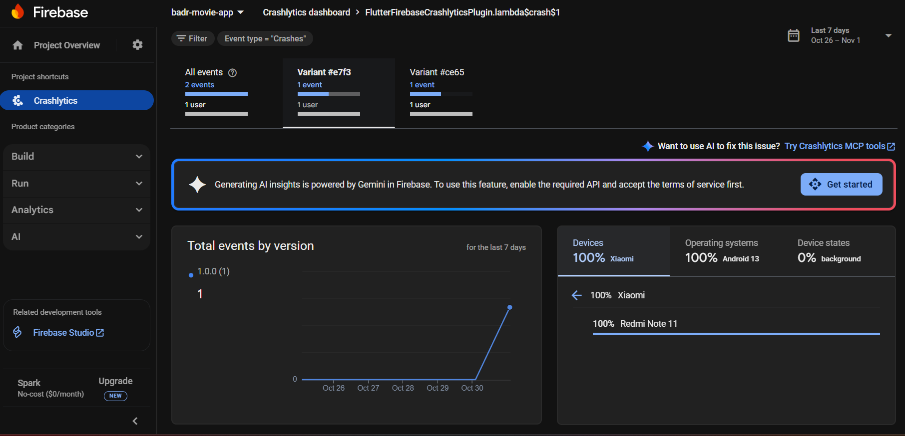
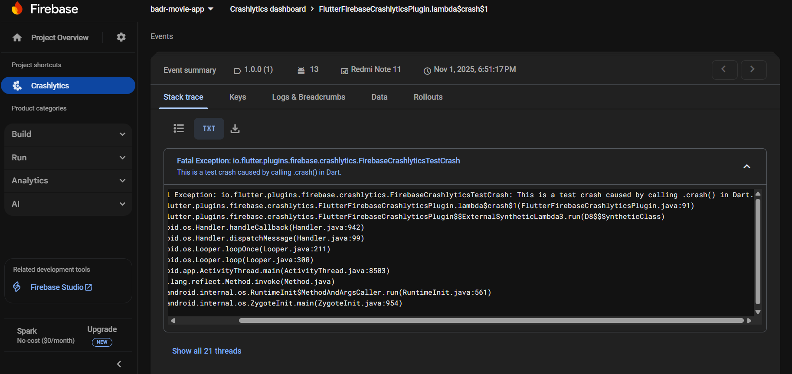

# 🎬 Simple Movie App

[](https://deepwiki.com/Badr-Elarby/movie_app)

A Flutter application for browsing popular movies, demonstrating modern app architecture, offline caching, and dynamic theming. The app fetches data from The Movie Database (TMDB) API and provides a seamless user experience for discovering and exploring movies.


A Flutter app built with **Clean Architecture**, **Cubit**, and **Firebase Crashlytics** integration.  
Supports both **Light** and **Dark** themes 🌗


* * * * * * * * * * * * * * * * * * * * * * * * * * * * * * * * * * * * * * * * * * * * * * * * * * * * * * * * * * * * * * *
**For a deeper understanding of the project — including detailed diagrams and an in-depth breakdown of each layer and feature —** 
**[click here](https://deepwiki.com/Badr-Elarby/movie_app)**.
* * * * * * * * * * * * * * * * * * * * * * * * * * * * * * * * * * * * * * * * * * * * * * * * * * * * * * * * * * * * * * *

## Features

- **Movie Discovery**: Browse a paginated list of popular movies.
- **Movie Details**: View detailed information for each movie, including poster, rating, genres, and overview.
- **Offline Caching**: Utilizes Hive for local data persistence. The app automatically loads cached data when offline and fetches fresh data when online.
- **Infinite Scrolling**: Load more movies by tapping the "Load More" button at the end of the list.
- **Theme Switching**: Dynamically switch between light and dark themes.
- **Error Handling**: Implements Firebase Crashlytics for crash reporting and displays user-friendly error messages for network or data issues.
- **Responsive UI**: Built with a responsive layout for a great experience on various screen sizes.

## Technical Stack & Architecture

This project is built following Clean Architecture principles to ensure a scalable, testable, and maintainable codebase.

- **Framework**: [Flutter](https://flutter.dev/)
- **Architecture**: Clean Architecture
  - **Data Layer**: Manages all data operations. It includes:
    - **Repositories**: Acts as a single source of truth for data, orchestrating between remote and local sources based on network connectivity.
    - **Data Sources**:
      - `Remote`: Fetches live data from the TMDB API using the `dio` package.
      - `Local`: Caches API responses using `hive` for offline access.
    - **Models**: Plain Dart objects for data representation, with serialization handled by `json_serializable` and `hive_generator`.
  - **Presentation Layer**: Handles the UI and user interaction. It includes:
    - **Cubits**: Manages UI state using the `flutter_bloc` package for predictable state transitions (Loading, Success, Failure).
    - **Screens & Widgets**: Reactive UI components that rebuild based on Cubit states.
- **State Management**: [BLoC (Cubit)](https://bloclibrary.dev/)
- **Dependency Injection**: [GetIt](https://pub.dev/packages/get_it) for decoupling services, repositories, and cubits.
- **Networking**: [Dio](https://pub.dev/packages/dio) with an interceptor for handling API authentication.
- **Local Storage**: [Hive](https://pub.dev/packages/hive) for fast and efficient offline data caching.
- **Image Handling**: [CachedNetworkImage](https://pub.dev/packages/cached_network_image) for efficient loading and caching of movie posters.
- **Routing**: Flutter's built-in `onGenerateRoute` for named routing.


## 🧩 Tech Stack
- Flutter (Clean Architecture)
- Cubit (State Management)
- Firebase Crashlytics
- Fastlane (Firebase App Distribution)
- Caching with Shared Preferences


## Getting Started

### Prerequisites
- Flutter SDK (version ^3.8.1 or higher)
- A code editor like VS Code or Android Studio

### Installation

1.  **Clone the repository:**
    ```sh
    git clone https://github.com/badr-elarby/movie_app.git
    cd movie_app
    ```

2.  **Install dependencies:**
    ```sh
    flutter pub get
    ```

3.  **Configure API Key:**
    This project uses The Movie Database (TMDB) API. You need to provide your own API key.

    -   Open `lib/core/network/dio_interceptor.dart`.
    -   Replace the placeholder `_token` with your TMDB API v4 Bearer Token.

    ```dart
    // lib/core/network/dio_interceptor.dart
    
    class AuthInterceptor extends Interceptor {
      // Replace with your own TMDB Bearer Token
      static const String _token = 'YOUR_TMDB_BEARER_TOKEN_HERE';
    
      // ...
    }
    ```

### Running the App

Execute the following command to run the application on your connected device or emulator:
```sh
flutter run
```

To enable crash reporting with Firebase Crashlytics, configure a Firebase project for the app and add your own `google-services.json` (for Android) and `GoogleService-Info.plist` (for iOS).

## Project Structure

The project follows a feature-based structure within the `lib` directory.

```
lib/
├── core/
│   ├── di/                 # Dependency Injection (GetIt)
│   ├── network/            # Dio client and interceptors
│   ├── routing/            # App navigation logic
│   └── theming/            # Light/Dark theme configuration
│
└── features/
    └── movies/
        ├── data/
        │   ├── datasources/  # Remote (API) and Local (Hive) data sources
        │   ├── models/       # Data models (Movie, MovieDetails, etc.)
        │   └── repositories/ # Data orchestration
        │
        └── presentation/
            ├── cubits/       # State management (MoviesCubit, MovieDetailsCubit)
            ├── screens/      # UI screens (MoviesList, MovieDetails)
            └── widgets/      # Reusable UI components
```


---

## 🌟 Light Theme
| Home Screen | Home Screen (Scroll) | Details Screen |
|--------------|----------------------|----------------|
|  |  |  |

---

## 🌙 Dark Theme
| Home Screen | Home Screen (Scroll) | Details Screen |
|--------------|----------------------|----------------|
|  |  |  |

---

## 🧠 Firebase Crashlytics
Crash reports tracked successfully using **Firebase Crashlytics** 🔥  

| Crash Dashboard | Crash Dashboard | Crash Dashboard |
|-----------------|-----------------|-----------------|
|  |  |  |

---

## 🎥 Demo (GIF)


---
