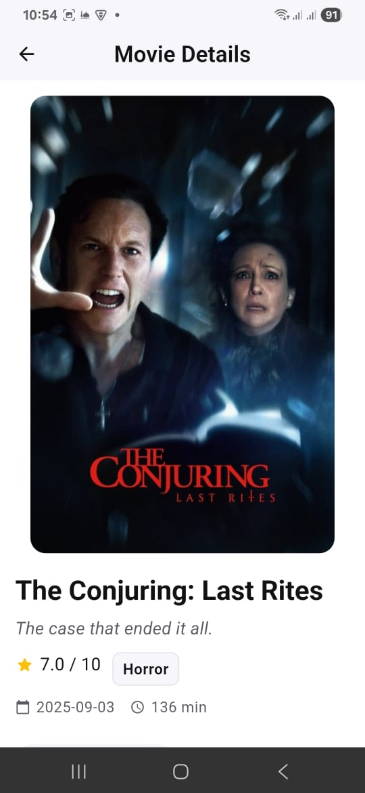
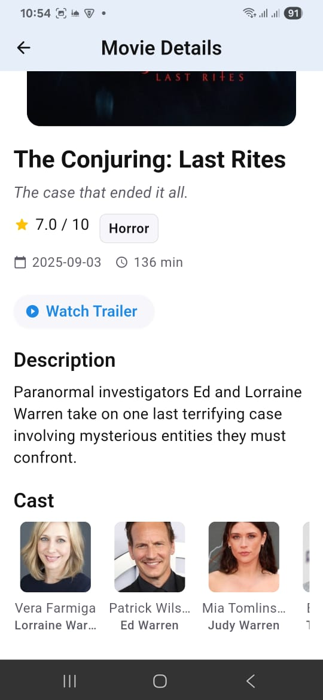
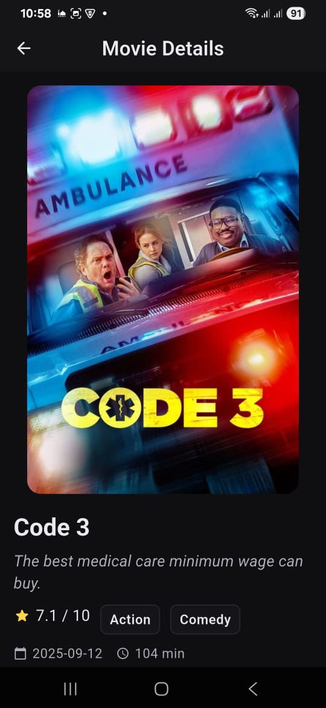

# 🎬 Simple Movie App

[](https://deepwiki.com/Badr-Elarby/movie_app)

A Flutter application for browsing popular movies, demonstrating modern app architecture, offline caching, and dynamic theming.  
The app fetches data from The Movie Database (TMDB) API and provides a seamless user experience for discovering and exploring movies.

A Flutter app built with **Clean Architecture**, **Cubit**, and **Firebase Crashlytics** integration.  
Supports both ***Light*** and ***Dark*** themes 🌗

---

**For a deeper understanding of the project — including detailed diagrams and an in-depth breakdown of each layer and feature —**  
**[click here](https://deepwiki.com/Badr-Elarby/movie_app)**.

---

## Features

- **Movie Discovery**: Browse a paginated list of popular movies.  
- **Movie Details**: View detailed information for each movie, including poster, rating, genres, and overview.  
- **Offline Caching**: Utilizes Hive for local data persistence. The app automatically loads cached data when offline and fetches fresh data when online.  
- **Infinite Scrolling**: Load more movies by tapping the "Load More" button at the end of the list.  
- **Theme Switching**: Dynamically switch between light and dark themes.  
- **Error Handling**: Implements Firebase Crashlytics for crash reporting and displays user-friendly error messages for network or data issues.  
- **Responsive UI**: Built with a responsive layout for a great experience on various screen sizes.

---

## Technical Stack & Architecture

This project is built following **Clean Architecture** principles to ensure a scalable, testable, and maintainable codebase.

- **Framework**: [Flutter](https://flutter.dev/)
- **Architecture**: Clean Architecture
  - **Data Layer**:  
    - **Repositories**: Acts as a single source of truth for data.  
    - **Data Sources**:  
      - `Remote`: Fetches data from the TMDB API using `dio`.  
      - `Local`: Caches data using `hive` for offline access.  
  - **Presentation Layer**:  
    - **Cubits**: State management using `flutter_bloc`.  
    - **Screens & Widgets**: Reactive UI that rebuilds based on Cubit states.
- **State Management**: [BLoC (Cubit)](https://bloclibrary.dev/)
- **Dependency Injection**: [GetIt](https://pub.dev/packages/get_it)
- **Networking**: [Dio](https://pub.dev/packages/dio)
- **Local Storage**: [Hive](https://pub.dev/packages/hive)
- **Image Handling**: [CachedNetworkImage](https://pub.dev/packages/cached_network_image)
- **Routing**: `onGenerateRoute` with named routes.

---

## 🧩 Tech Stack

- Flutter (Clean Architecture)
- Cubit (State Management)
- Firebase Crashlytics
- Fastlane (Firebase App Distribution)
- Caching with Shared Preferences
- Theme Switching

---

<div align="center">
<h2 style="color:#ff6b6b;">⚡ DATA SOURCE: ONLINE — FALLBACK TO CACHE WHEN OFFLINE ⚡</h2>
</div>

**How it works:**  
- ✅ When the device has internet → app calls the TMDB API and updates Hive cache.  
- 📴 When offline → app reads from Hive cache and displays cached images (`cached_network_image`).

---

## Getting Started

### Prerequisites
- Flutter SDK (version ^3.8.1 or higher)
- VS Code or Android Studio

### Installation

1. **Clone the repository:**
   ```bash
   git clone https://github.com/badr-elarby/movie_app.git
   cd movie_app
   ```

2. **Install dependencies:**
   ```bash
   flutter pub get
   ```

3. **Configure API Key:**
   Replace `_token` in `lib/core/network/dio_interceptor.dart` with your TMDB API key.

   ```dart
   class AuthInterceptor extends Interceptor {
     static const String _token = 'YOUR_TMDB_BEARER_TOKEN_HERE';
   }
   ```

4. **Run the app:**
   ```bash
   flutter run
   ```

---

## Project Structure

```
lib/
├── core/
│   ├── di/                 # Dependency Injection
│   ├── network/            # Dio client & interceptors
│   ├── routing/            # App navigation logic
│   └── theming/            # Theme configuration
│
└── features/
    └── movies/
        ├── data/           # API & Hive data sources
        ├── models/         # Data models
        └── presentation/   # Cubits, Screens, Widgets
```

---

## 🌟 Light Theme

| Home 1 | Home 2 | Details 1 | Details 2 | Trailer |
|--------|--------|------------|------------|----------|
|  |  |  |  |  |

---

## 🌙 Dark Theme

| Home 1 | Home 2 | Details 1 | Details 2 |
|--------|--------|------------|------------|
|  |  |  |  |

---

## 🧠 Firebase Crashlytics

Crash reports tracked successfully using **Firebase Crashlytics** 🔥

| Dashboard 1 | Dashboard 2 | Dashboard 3 |
|-------------|-------------|-------------|
|  |  |  |

---

## 🎥 Demo (GIF)


---
